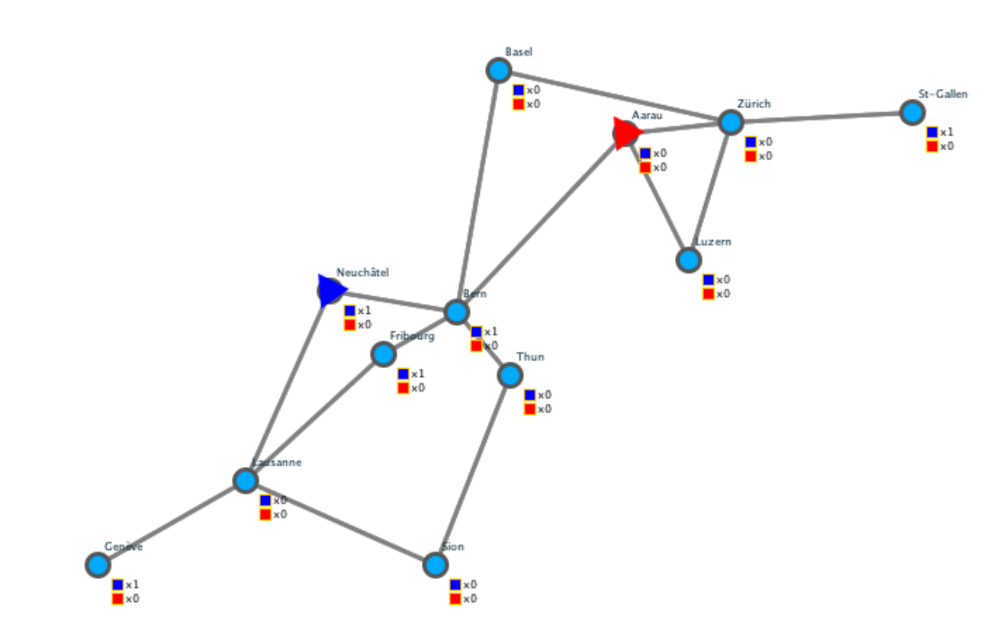

# Intelligent agents

This repository contains all homework assignments for the 2019 intelligent agents class at EPFL.

All assignments aim to solve the **Pickup and Delivery problem**, a problem where one or more trucking companies try to deliver tasks from one city to another at the lowest possible cost. Each company can have multiple vehicles that have different capacities and different cost per kilometer. Tasks can either have a fixed reward or can be auctioned  to the lowest bidder in the case of competing companies.

Concretely the assignments are structured as follows:

1. **Reactive agent** using Reinforcement learning (Markov decision processes)
2. **Deliberative agent** using A* for state-based search
3. **Centralized agent** using a Stochastic local search algorithm
4. **Auctioning agent** that uses SLS, multiplicative weight updates and other heuristics

At the end of the course a tournament between the 32 best teams was held. After a group stage the eight group stage winners advanced to a single elimination tournament.

Our auctioning agent finished *4th* at this competition.